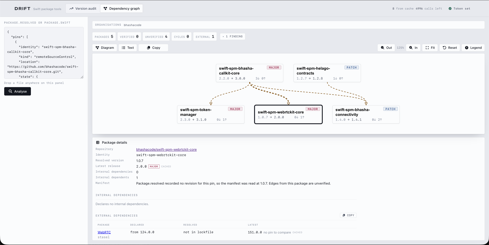

<h1 align="center">Drift</h1>

<p align="center">
  <em>See how far behind your Swift packages have drifted — and which of your own packages hold them back.</em>
</p>

<p align="center">
  <a href="https://github.com/prashan-s/drift/actions/workflows/ci.yml"></a>
  <a href="https://prashan-s.github.io/drift/"></a>
  
  
  
  
</p>

<p align="center"><b><a href="https://prashan-s.github.io/drift/">Open the app →</a></b></p>



## Why this exists

Working across a pile of Swift packages — some public, most of them libraries we
wrote ourselves — the same question kept coming up before every release: *what
is actually out of date, and which of our own packages is pinning it there?*

Answering it meant opening `Package.resolved`, opening a dozen GitHub tag pages,
and comparing version numbers by eye. Drift does that comparison for you. Paste
a manifest, get a straight answer.

## What it does

Paste a `Package.resolved`, a `Package.swift`, or a list of GitHub URLs once.
Two views read the same input:

| View | The question it answers |
| --- | --- |
| **Version audit** (`#/audit`) | How far behind is every pin — major, minor, or patch? |
| **Dependency graph** (`#/graph`) | Which of our own packages depends on which, and at what version? |

Colour is used for exactly one thing: the size of the gap. In each version cell
only the segment that changed is lit, so a column of versions reads as a column
of deltas.

A few details that matter in practice:

- **Edges are real.** Every graph edge comes from a `Package.swift` read at the
  pinned revision. A lockfile records what resolved, not who asked for it, so a
  pin never invents an edge on its own. Edges read at a tag or default branch
  instead are marked *unknown* rather than *verified*.
- **Requests are rationed.** Only the latest release of each package is fetched
  up front; older releases and third-party versions load on demand. For a busy
  repository that is 35 KB instead of 358 KB.
- **Results are cached.** Releases, the manifest and your settings live in
  IndexedDB. A reload paints from cache with no network call, and when a later
  fetch disagrees it shows what changed (`was 5.4.0`) instead of quietly
  swapping the number.
- **The graph is keyboard-navigable**, with a Text view carrying the same facts
  for screen readers and for pasting into a pull request.

Local paths, registry (`id:`) dependencies and non-GitHub hosts are listed in
place and marked as skipped.

## Run it locally

```bash
bun install
bun dev      # http://localhost:5173
bun test     # 173 tests
bun run build
```

## GitHub token

Optional. Without one you get public repositories at 60 requests/hour; with one,
private repositories at 5,000.

Paste it into the field in the app header — it stays in `localStorage` and is
sent only as an `Authorization` header to `api.github.com`. For local
development you can instead `cp .env.example .env.local` and set
`VITE_GITHUB_TOKEN`.

> Vite inlines `VITE_*` variables into the bundle, so never build for deployment
> with `.env.local` set. The deploy workflow builds without it.

Scopes: classic tokens need `repo`; fine-grained tokens need **Contents: read**
on each repository you want scanned — metadata alone reads tags but not
manifests, so the graph will have no edges to draw.

## Deployment

Pushes to `main` build the site and publish it to GitHub Pages via
[`deploy.yml`](.github/workflows/deploy.yml). Assets are referenced relatively
and routing is hash-based, so the build runs from a project path with no server
rewrites.

## Internals

Design notes and the reasoning behind the graph model: [`src/graph/DESIGN.md`](src/graph/DESIGN.md).
